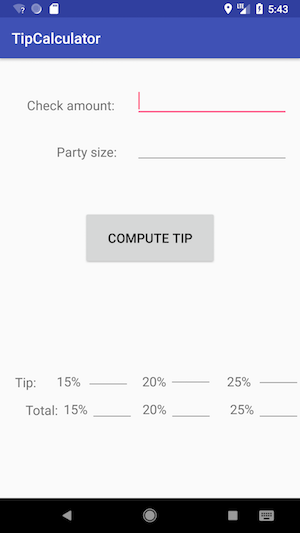
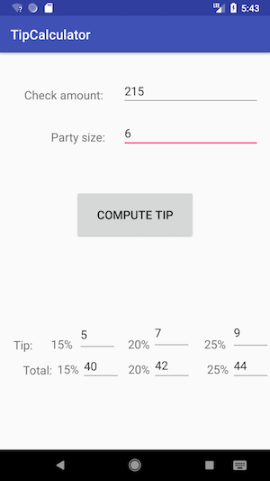

# Tip Calculator
* **Perry Raskin**
* **CS370: Software Engineering**
* **Assignment 4: Android Development**
* **Android Studio v3.0**

## App Usage
This app works on the Android OS, and it calculates the tip and total cost per person upon the input of the **check amount** and the **party size**. You can calculate the 15%, 20%, and 25% tip, and the total cost including the corresponding tip.

## App Testing
### Installation
* You'll need Android Studio https://developer.android.com/studio/index.html.
* Assuming you downloaded/cloned this repo, open an existing project and choose this folder (Assignment 4).
* You can either run the app on an Android emulator, provided by Android Studio, or you can use your own Android phone if you own one. Developer mode must be enabled for this to work.
* For an Android phone plugged in, use USB Debugging and click run.
* Otherwise, you can still click run and choose the emulator and the specs necessary.
* The app should automatically open on either the Android phone, or the emulator.

### Expected Results
* For empty text fields, along with values less than 1, an error message will appear.
* Input into the top two fields, and below you should see the tip results.

## Screenshots
 
